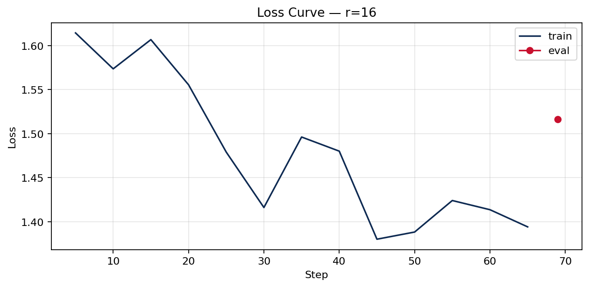

# Lab 21 — Evaluation Report

**Học viên**: Nhữ Gia Bách — 2A202600248  
**Ngày nộp**: <YYYY-MM-DD>  
**Submission option**: B (ZIP + HuggingFace Hub)

## 1. Setup

- **Base model**: <ví dụ `unsloth/Qwen2.5-3B-bnb-4bit`>
- **Dataset**: `5CD-AI/Vietnamese-alpaca-gpt4-gg-translated`, 200 samples (<X> train + <Y> eval)
- **max_seq_length**: <số> (p95 = <số>, rounded up)
- **GPU**: <Tesla T4 / L4 / A100>, <X> GB VRAM
- **Training cost**: $<số> (~<phút> @ $<rate>/hr)
- **HF Hub link**: https://huggingface.co/AgentZoil/qwen2.5-3b-vi-lab21-r16

## 2. Rank Experiment Results

| Rank | Trainable Params | Train Time | Peak VRAM | Eval Loss | Perplexity |
|------|------------------|------------|-----------|-----------|------------|
| 8    | <...>            | <...> min  | <...> GB  | <...>     | <...>      |
| 16   | <...>            | <...> min  | <...> GB  | <...>     | <...>      |
| 64   | <...>            | <...> min  | <...> GB  | <...>     | <...>      |
| Base | -                | -          | -         | <...>     | <...>      |

## 3. Loss Curve Analysis

- **Quan sát**: <có / không có overfitting?>
- **Lý do**: <giải thích ngắn gọn dựa trên train loss / eval loss>

## 4. Qualitative Comparison (5 examples)

### Example 1
**Prompt**: <...>  
**Base**: <...>  
**Fine-tuned (r=16)**: <...>  
**Nhận xét**: <improved / same / degraded?>

### Example 2
**Prompt**: <...>  
**Base**: <...>  
**Fine-tuned (r=16)**: <...>  
**Nhận xét**: <...>

### Example 3
**Prompt**: <...>  
**Base**: <...>  
**Fine-tuned (r=16)**: <...>  
**Nhận xét**: <...>

### Example 4
**Prompt**: <...>  
**Base**: <...>  
**Fine-tuned (r=16)**: <...>  
**Nhận xét**: <...>

### Example 5
**Prompt**: <...>  
**Base**: <...>  
**Fine-tuned (r=16)**: <...>  
**Nhận xét**: <...>

## 5. Conclusion về Rank Trade-off

<Viết tối thiểu 100 từ. Trả lời rõ: rank nào cho ROI tốt nhất, diminishing returns xuất hiện ở đâu, và nếu deploy production thì chọn rank nào.>

## 6. What I Learned

- <Bullet 1: insight cá nhân>
- <Bullet 2: insight cá nhân>
- <Bullet 3: optional>
